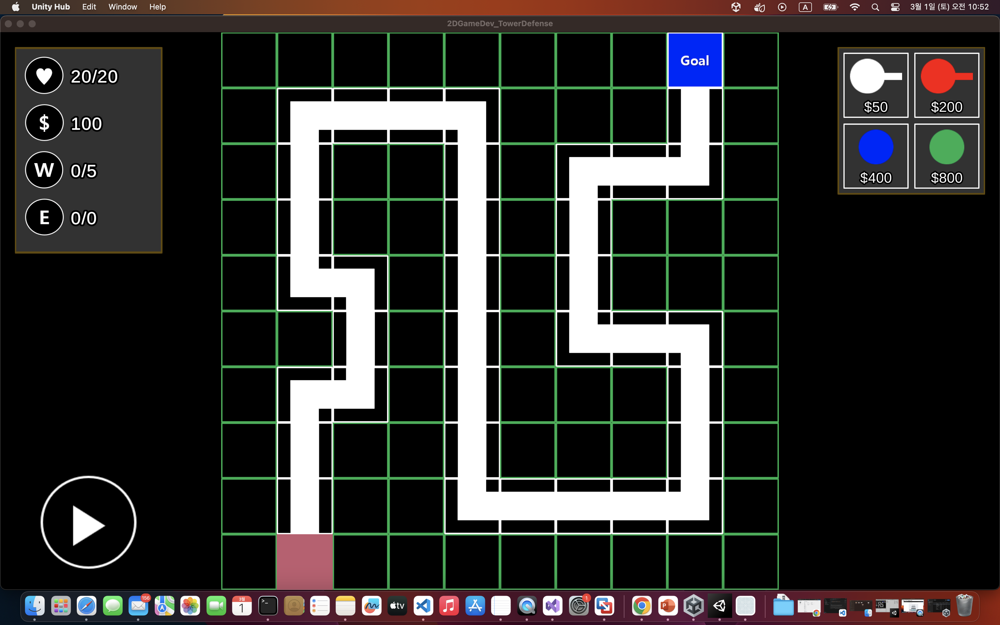
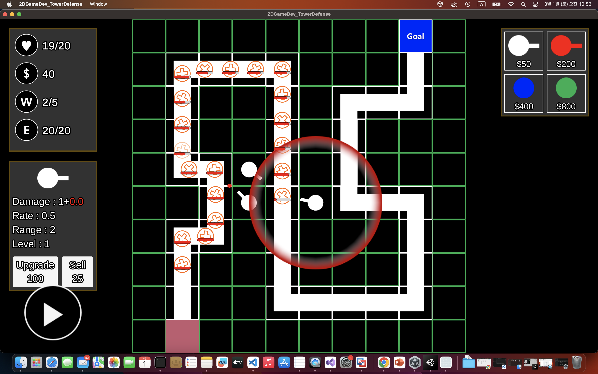
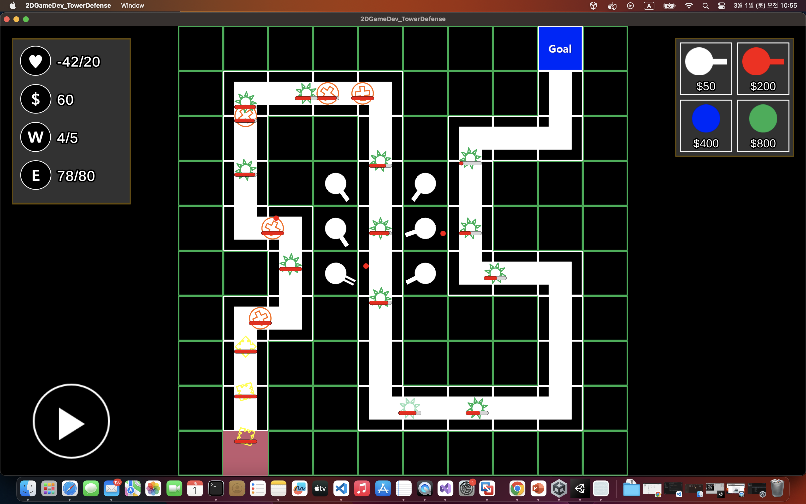
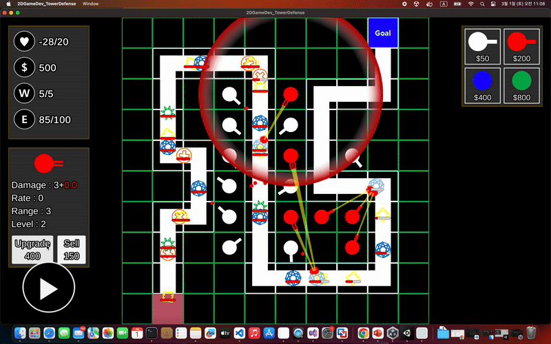

# Unity 2D Tower Defense


<div style="display: flex; justify-content: space-around;">
  
  
  
</div>


---
---
<br>


# Overview
UnityTowerDefense is a strategic tower defense game where players must defend their base from waves of enemies. Players can place towers, upgrade them, and manage resources to survive increasing levels of difficulty.


---
---
<br>


# Feature


1. Tower Placement System: 
  - Drag & drop towers onto the battlefield. 
<br>

2. Wave-based Enemy System:
  - Enemies attack in waves with increasing difficulty.  
<br>
  
3. Multiple Tower Types:
  - Different towers with unique abilities.  
<br>

4. Upgrade System:
  - mprove towers to enhance damage and range.
<br>

5. Resource Management:
  - Earn money and strategically spend it on defense.
<br>

6. Dynamic UI:
  - Real-time health, money, and wave status displayed.  
  - Smooth animations and physics interactions.


---
---
<br>

# Core technologies


- **Unity** - Game development engine for rendering, physics, and game logic.
<br>

- **ScriptableObjects** - Efficient data management for towers, enemies, and upgrades. 
<br>

- **Unity UI System** - For displaying in-game HUD, menus, and status bars.
<br>

- **Singleton Pattern** - Used for GameManager, WaveManager, and UI handling.
<br>


---
---
<br>

# Deployment

## 1. Installation

```bash
git clone https://github.com/sudoyh/UnityTowerDefense.git

cd UnityTowerDefense
```

<br>

## 2. Open in Unity


- Launch Unity Hub
- Open UnityTowerDefense folder


## 3. Run the Game

- Click ▶ Play in the Unity Editor
- Defend your base and have fun

## Exe file for mac


[📄 Download exefile](https://github.com/sudoyh/UnityTowerDefense/YH_exefile_towerDefenseforMac.zip)

---
---
<br>


# Full video link 

Youtube : 


[📺 Youtube Link : https://youtu.be/sDKOmDd_sCM ](https://youtu.be/sDKOmDd_sCM)

---
---
<br>

# Demo




---
---

# Reference

https://youtube.com/playlist?list=PL5AKnriDHZs5a8De2wK_qqrwBUqjZo0hN&si=OF911xdDgQEXCd3z
